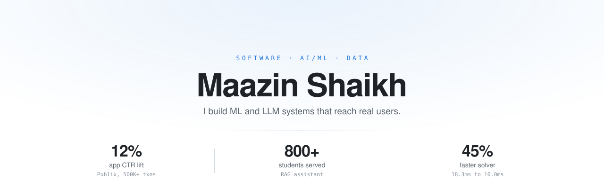
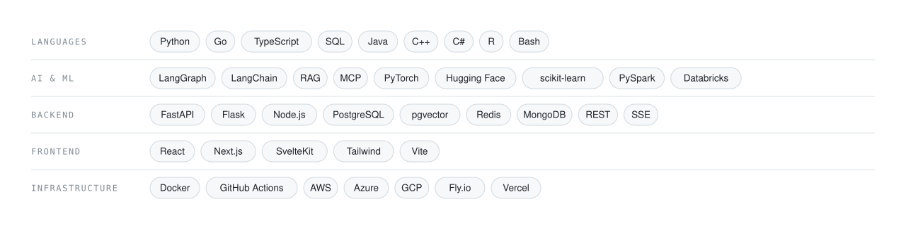

<picture>
  <source media="(prefers-color-scheme: dark)" srcset="hero-dark.svg">
  
</picture>

Tampa, FL &nbsp;·&nbsp; B.S. Computer Science, University of South Florida &nbsp;·&nbsp; <b>Open to full-time roles</b>

 

## Selected Work

<table>
<tr>
<td width="50%" valign="top">

<b>RETRIEVAL · LLM PIPELINES</b> 
<a href="https://github.com/maazin/Weak_Spot"><b>WeakPoint</b></a> &nbsp;<a href="https://weakspot-web.fly.dev/">live&nbsp;&#8599;</a>
  
Diagnoses <i>why</i> a code submission failed, not just that it did. Five LangGraph nodes classify failures into <b>51 conceptual modes</b> at <b>75% top-1 accuracy</b> for <b>$0.0084 per request</b>.
  
Hybrid retrieval fuses Postgres full-text with pgvector through weighted Reciprocal Rank Fusion - <b>0.412 precision@3</b>, beating both baselines. A lexical vaulting layer blocked <b>40/40</b> injection attempts across <b>155 CI tests</b>.
  
<code>Python</code> <code>FastAPI</code> <code>LangGraph</code> <code>MCP</code> <code>pgvector</code> <code>Redis</code>

</td>
<td width="50%" valign="top">

<b>SYSTEMS · PERFORMANCE</b> 
<a href="https://github.com/maazin/Overlap"><b>Overlap</b></a> &nbsp;<a href="https://overlap-flax-psi.vercel.app/">live&nbsp;&#8599;</a>
  
Group scheduling with no accounts and no login <b>6 taps</b> to respond. A dominance-analysis solver proves when a time is mathematically unbeatable regardless of who hasn't replied.
  
Closure-based resolvers cut solver runtime <b>45%</b> and memory <b>73%</b>. TTL caching and single-flight dedup collapsed 100 concurrent requests from 100 outbound fetches to <b>1</b>.
  
<code>Go</code> <code>SvelteKit</code> <code>PostgreSQL</code> <code>sqlc</code> <code>SSE</code> <code>Docker</code>

</td>
</tr>
<tr>
<td width="50%" valign="top">

<b>DATA ENGINEERING · ETL</b> 
<a href="https://github.com/maazin/Recall_Radar"><b>Recall Radar</b></a> &nbsp;<a href="https://recallradar-web.onrender.com/">live&nbsp;&#8599;</a>
  
One searchable feed for federal food-recall data. An ETL pipeline unifies <b>4 sources</b> (FDA, USDA/FSIS, CDC) into a normalized schema, indexing <b>2,000+ advisories</b> with <b>sub-200ms</b> search and cutting duplicates <b>39%</b>.
  
Fail-fast validation rejects malformed payloads before any write, covered by <b>186 tests</b>.
  
<code>Python</code> <code>FastAPI</code> <code>React</code> <code>PostgreSQL</code> <code>CI/CD</code>

</td>
<td width="50%" valign="top">

<b>RAG · PRODUCTION</b> 
<a href="https://github.com/maazin/AskRocky"><b>AskRocky</b></a> &nbsp;<a href="https://askrocky.vercel.app/">live&nbsp;&#8599;</a>
  
RAG chatbot answering campus questions for <b>800+ USF freshmen</b>. Scraped and chunked <b>3,575 pages</b> into 384-dimensional BGE embeddings in Pinecone, citing the top 4 cosine matches on every reply.
  
Held latency near <b>4 seconds</b> by preloading the embedding model behind a readiness probe, serving a degraded answer during cold start.
  
<code>Python</code> <code>Flask</code> <code>LangChain</code> <code>Pinecone</code> <code>Hugging Face</code>

</td>
</tr>
<tr>
<td width="50%" valign="top">

<b>APPLIED LLM</b> 
<a href="https://github.com/maazin/StudyPDF"><b>StudyPDF</b></a> &nbsp;<a href="https://studypdf.streamlit.app">live&nbsp;&#8599;</a>
  
Upload a PDF, get summaries, auto-generated quizzes, and grounded Q&amp;A, with Groq handling low-latency inference.
  
<code>Python</code> <code>Streamlit</code> <code>Groq</code>

</td>
<td width="50%" valign="top">

<b>RESEARCH · EVALUATION</b> 
<a href="https://github.com/maazin/LLM_Project"><b>LLM Prompting Study</b></a>
  
Benchmarked zero-shot vs. few-shot vs. chain-of-thought prompting of Gemma 3 against an RNN baseline on IMDB sentiment — a controlled look at when prompting beats fine-tuning.
  
<code>PyTorch</code> <code>Transformers</code> <code>NLP</code>

</td>
</tr>
</table>

<b>More machine learning work</b>

 

**[Airline Satisfaction Prediction](https://github.com/maazin/Airline-Passanger-Satisfaction-Prediction)** - Random Forest classifier predicting passenger satisfaction from **100k+** survey records.
 `Python` · `scikit-learn`

 

**[Movie Recommender](https://github.com/maazin/Movie-Recommendation)** — Collaborative-filtering recommender (KNN) on MovieLens, served through Streamlit.
 `Python` · `scikit-learn` · `Streamlit`

 

**[Score Predictor](https://github.com/maazin/score-predictor)** — Linear regression predicting exam scores from study hours.
 `Python` · `Streamlit`

 

**[SQL Projects](https://github.com/maazin/SQL-Projects)** — Fortune 500 analysis of benefits, sustainability, and satisfaction by sector.
 `SQL`

 

## Experience

<table>
<tr>
<td valign="top" width="34%">

<b>Data Science &amp; ML Intern</b> 
Publix &nbsp;·&nbsp; May 2025 – Jul 2025

</td>
<td valign="top">

Deployed a personalized deal-ranking model in Azure Databricks with PySpark — <b>+12%</b> app click-through, <b>+9%</b> engagement in pilot. 
Engineered <b>20+</b> customer and product features (purchase frequency, category affinity, deal scarcity) for <b>+15%</b> precision offline. 
Ran predictive and causal analysis on <b>500K+</b> transactions, surfacing four stockout drivers and cutting out-of-stocks <b>10%</b>.

</td>
</tr>
<tr>
<td valign="top">

<b>AI Research Assistant</b> 
University of South Florida &nbsp;·&nbsp; Jan 2025 – Apr 2025

</td>
<td valign="top">

Built an AI grader for Algorithms coursework with multi-agent LLMs — <b>90%</b> agreement with human graders. 
Implemented the grading workflow in Python with LangChain and RAG, generating feedback on <b>100+</b> submissions and cutting grading time <b>70%</b>.

</td>
</tr>
<tr>
<td valign="top">

<b>Data Analyst Intern</b> 
The Global Tech Experience &nbsp;·&nbsp; Jan 2024 – May 2024

</td>
<td valign="top">

Analyzed <b>2M+</b> monthly web-traffic and energy records to define 5 KPIs — <b>+28%</b> visitor engagement. 
Shipped <b>8+</b> interactive Tableau dashboards, cutting report turnaround <b>30%</b>. 
Planned and executed A/B tests driving a <b>20%</b> lift in conversion.

</td>
</tr>
</table>

 

## Stack

<picture>
  <source media="(prefers-color-scheme: dark)" srcset="stack-dark.svg">
  
</picture>

 

## Leadership &amp; Honors

<table>
<tr>
<td valign="top" width="58%">

<b>Head Director</b> &nbsp;SHPE Jr &nbsp;·&nbsp; Jun 2025 – May 2026 
Lead a team of 5 delivering <b>10+ STEM workshops per semester</b> to <b>150+ students</b>, driving a <b>25%</b> increase in CS and engineering pathway engagement.
  
<b>Vice President</b> &nbsp;Data Science Club at USF &nbsp;·&nbsp; May 2024 – Apr 2025 
Ran hackathons and ML workshops with an 8-member executive board, engaging <b>200+ students</b> through partnerships with Bank of America, Citi, and Amgen.
  
<b>Director of Events</b> &nbsp;AI Society at USF &nbsp;·&nbsp; Aug 2024 – Dec 2024 
Directed 7 technical events and secured <b>$6,000</b> in funding, driving a <b>30%</b> increase in member retention.
  
<b>Resident Assistant</b> &nbsp;University of South Florida &nbsp;·&nbsp; Aug 2025 – May 2026 
Named <b>Student Staff of the Year</b> with an Exemplary performance rating and a 100% on-time completion rate across all operational reports.

</td>
<td valign="top">

<b>USF Presidential Scholarship</b> 
University of South Florida
  
<b>Green &amp; Gold Scholarship</b> 
University of South Florida
  
<b>NSBE International Scholarship</b> 
National Society of Black Engineers
  
<b>USF Engineering Dean's Scholarship</b> 
USF College of Engineering
  
<b>Judy Genshaft Honors Scholar</b> 
University of South Florida &nbsp;·&nbsp; GPA 3.87

</td>
</tr>
</table>

 

<b>Building something at the intersection of AI and real users? Let's talk.</b>

<a href="mailto:contactmaazin@gmail.com">contactmaazin@gmail.com</a> &nbsp;·&nbsp; <a href="https://www.linkedin.com/in/maazin-shaikh">LinkedIn</a> &nbsp;·&nbsp; <a href="https://www.maazin.site">maazin.site</a>

